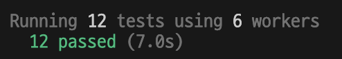

# React State Update Timing Issue

리액트 state batch update <-> 유저 인터랙션 사이 갭으로 인해
mutation 호출 후 isPending이 true임에도 버튼이 눌리는 현상 재현

## 테스트 케이스

버튼을 누르면 500ms 동안 로딩 상태가 되고 그 후 카운트가 증가하는 카운터
button disabled에 로딩 상태를 전달, 로딩중에는 버튼을 누를 수 없음

- [src/routes/index.tsx](./src/routes/index.tsx): 일반적인 사용예
- [src/routes/flushSync.tsx](./src/routes/flushSync.tsx): `flushSync` 사용

## Playwright 테스트

```ts
test('더블클릭 테스트', async ({ page }) => {
  const button = page.getByRole('button', { name: 'Click me' })

  await button.click()
  await delay(10)
  await button.click()

  // 일반적인 사용예에서 expect 2
  await expect(page.getByText('Count: 2')).toBeVisible()
  // flushSync 사용 시 expect 1
  await expect(page.getByText('Count: 1')).toBeVisible()
})
```

10ms 차이를 두고 더블클릭 시도할 경우를 시뮬레이트함 (chromium, firefox, webkit 모두 테스트)

```bash
pnpm test
# or
pnpm test:ui
```

그 결과 모두 통과함



즉, 일반적인 사용예에서 더블클릭시 버튼이 두번 눌리는 현상이 발생함 (`flushSync` 사용 시 버튼은 한 번 눌림)
